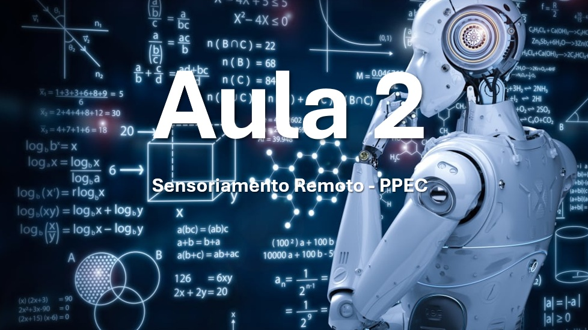

# Aulas 1 - Apresentação da disciplina introdução à GeoAI aplicada ao SR

Aula introdutória que descreve principais assuntos a serem debatidos durante o curso.

# Aulas 2 - Configuração do Ambiente

Introdução ao Python e instalação de bibliotécas e recursos importantes para execussão de tarefas de GeoAI.

